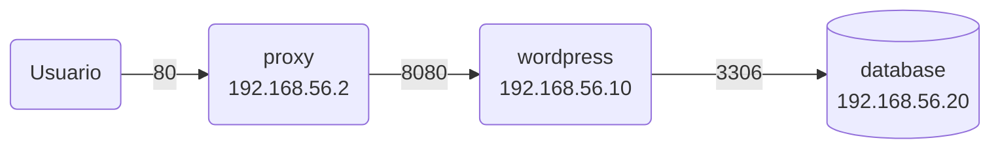
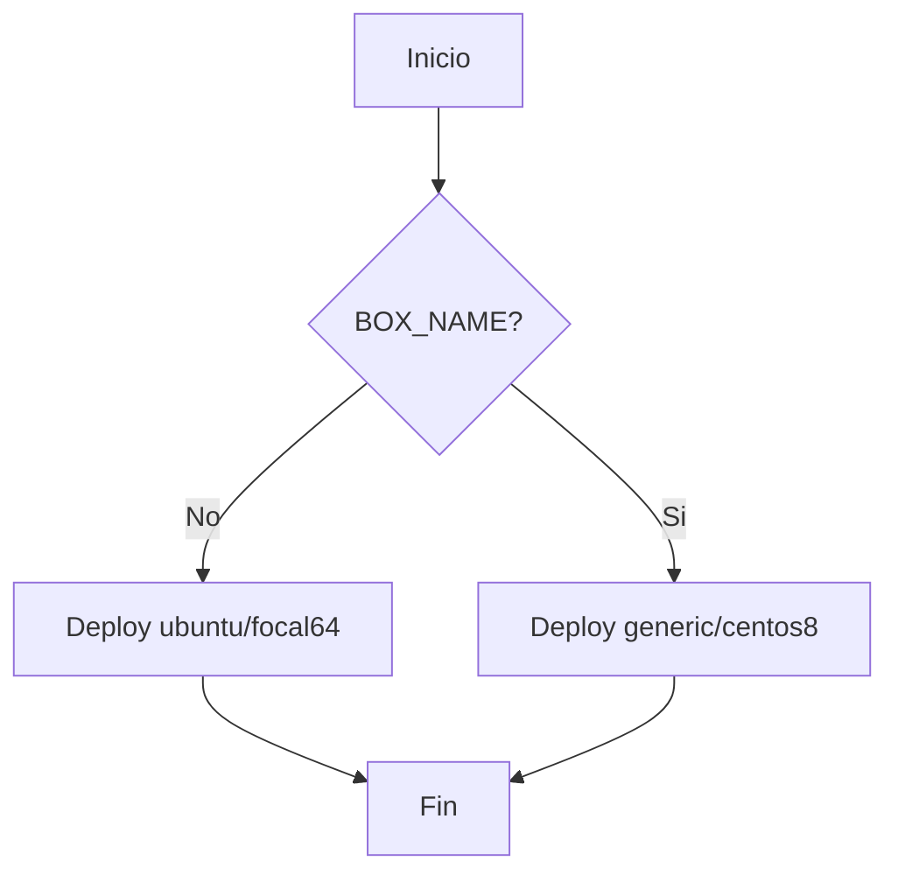

# Despliegue de Wordpress usando Vagrant y Chef

- Master 

Este proyecto es para una tarea de la Maestría en Desarrollo y Operaciones de EPNEWMAN.

El Objetivo es desplegar Wondpress usando Vagrant y Chef.

## Supuestos

- Se espera que la red de las VMs sea 192.168.56.0/24. Si VirtualBox tiene otro rango de red entonces hay que ajustar el archivio `.env` con los valores adecuados.

## Pre-requisitos

- Necesitas tener instalado Git
- Necesitas tener instalado Vagrant 2.3.7 o superior
- Necesitas tener instalado VirtualBox 7.0 o superior
- Ruby 2.5 o superior

Instala el plugin `vagrant-env` para poder cargar variables ed ambiente desde el archivo `.env`

```bash
 vagrant plugin install vagrant-env
```

También debes instalar la gema `serverspec` para poder ejecutar las pruebas de integración e infraestructura:

```bash
 gem install serverspec
```

## Arquitectura

El proyecto se compone de tres servicios, cada uno deployado en una VM individual:

- [database](cookbooks/database/README.md): En esta VM se instala MySQL.
- [wordpress](cookbooks/wordpress/README.md): En esta VM se instala el servidor web Apache y la aplicación Wordpress es instalada para ser servida por el servidor web.
- [proxy](cookbooks/proxy/README.md): Em esta VM se instala un proxy Nginx el cual será el punto de entrada a la aplicación.

En el siguiente diagrama se pueden ver cómo se relacionan las VMs y los puertos de comunicación que esa cada una de ellas:



## Configuraciones

En el archivo `.env` se pueden definir algunos valores como las IPs de las máquinas virtuales y el usuario y el password de la BD que se usará para configurar Wordpress.

Antes de levantar Vagrant se puede definir la caja que se usará. Mira el siguiente diagrama:



Lee la sección [Uso](#uso) para ver ejemplos de esto.

## Uso

Para levantar las dos máquinas virtuales con Ubuntu 20.04 ejecuta el comando:

```bash
 vagrant up
```

Para levantar las dos máquinas virtuales con CentOS 8 ejecuta el comando:

```bash
 BOX_NAME="generic/centos8" vagrant up
```

Se van a crear dos máquinas virtuales, una llamada `wordpress` y otra llamada `database`.
Si quieres mezclar las versiones puedes hacerlo del siguiente modo.

### Wordpress con Ubuntu y MySQL con CentOS:

```bash
 vagrant up wordpress
 BOX_NAME="generic/centos8" vagrant up database
```

### Wordpress con CentOS y MySQL con Ubuntu:

```bash
 BOX_NAME="generic/centos8" vagrant up wordpress
 vagrant up database
```

## Wordpress

Una vez que se hayan levantado todas las VMs podrás acceder a Wordpress en la página: http://192.168.56.2/


## Unit tests

Para ejecutar las pruebas unitarias usa el script `tests.sh` alojado en la carpeta UniTest si estás en Linux o Mac.

```bash
 #./tests.sh
 UnitTest/tests.sh
 Seleccione una opción:
 1. UnitTest en Máquina Virtual (VM)
 2. UnitTest en Docker
 3. UnitTest de integración e infraestructura
 4. Exit
 Opción: 
```

Si seleccionas 1 se ejecutará una VM usando Vagrant y ejecutará las pruebas unitarias.

Si seleccionas 2 se ejecutarán las pruebas unitarias usando Docker.

También puedes seleccionar una de estos dos opciones desde el script para no pasar por el menú:

```bash
 # Para ejecutar las pruebas unitarias en una VM.
 UnitTest//tests.sh vm

 # Para ejecutar las pruebas unitarias en Docker.
 UnitTest//tests.sh docker
```

## Pruebas de integración e infraestructura

Para ejecutar todas las pruebas de integración usa el script `tests.sh` opción 3:

```bash
 UnitTest/tests.sh
 Seleccione una opción:
 1. UnitTest en Máquina Virtual (VM)
 2. UnitTest en Docker
 3. UnitTest de integración e infraestructura
 4. Exit
 Opción: 
```

Si deseas ejecutar una a una las pruebas de integración e infraestructura entonces pásale el nombre de la receta al script `tests.sh`:

```bash
 # UnitTest base de datos (DB)
 UnitTest/tests.sh database

 # UnitTest Wordpress
 UnitTest/tests.sh wordpress

# UnitTest proxy
 UnitTest/tests.sh proxy
```

# Reference:
- Chef Documentation: https://docs.chef.io/
- ChefSpec: https://docs.chef.io/workstation/chefspec/
- ServerSpec: https://serverspec.org/resource_types.html
- Test Kitchen: https://docs.chef.io/workstation/kitchen/
